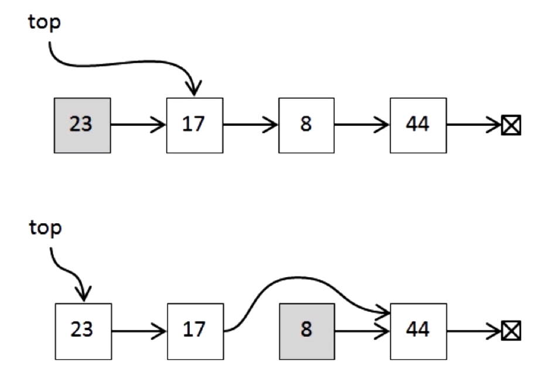
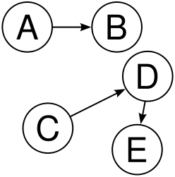
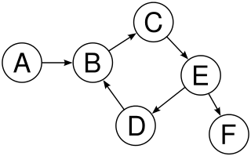
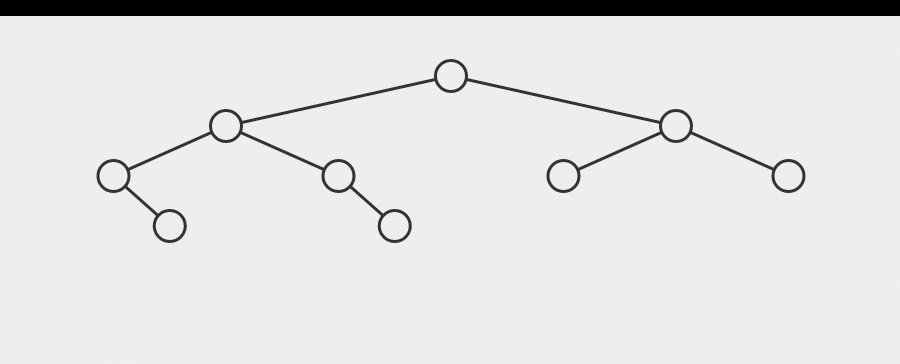

# Estructuras de Datos

Cuando hablamos a estructura de Datos nos referimos a cómo organizamos los datos cuando programamos. Básicamente, este tema trata de encontrar formar particulares de  organizar datos de tal manera que puedan ser utilizados de manera eficiente.

Imaginen que los datos que tenemos que manejar son libros!, y en un principio tenemos muchísimos libros desordenados por casa. Cada vez que queremos leer un libro, tardamos dos horas buscando uno por uno hasta dar con el libro. Eso no es eficiente. Entonces que hacemos? Bueno, podemos armar una biblioteca, por ejemplo, y acomodamos los libros en orden alfabético, esto nos ahorra tiempo en buscarlos. Y que pasa si tenemos demasiados libros y no entran en una biblioteca? Podemos tener un lugar donde depositamos los libros que menos usamos, y mantenemos una libretita donde especificamos qué libros dejamos ahí y en que depósito están.
En fin, podemos organizarlos de mil maneras, pero se entiende la idea que organizando los datos vamos a ser más eficientes, no?

## Arreglos

El arreglo es una estructura de datos que ya conocian! Es tan usada, que muchos lenguajes la implementan de forma nativa, como javascript.
El arreglo es una colección finita de elementos que ocupan espacios contiguos de memoria, y se pueden acceder a cada uno de ellos a traves de un índice.


Los arreglos nos sirven para guardar una colección de cosas (objetos, enteros, funciones, etc...) que tengan algo en común. Lo bueno de los arreglos es que la inserción es muy rápida, y es fácil acceder a un objeto si conocemos su índice. Pero no es tan bueno cuando tenemos que buscar un objeto en él, ya que tenemos que recorrerlo entero para encontrarlo. Borrar un elemento tambien es medio costoso.


## Sets

Un Set es una colección de elementos sin un orden en particular en donde _cada elemento puede aparecer una sola vez_. O sea, que es parecido a un arreglo, pero con la condición que cada elemento sea único.
En javascript los sets ya están implementados, y los podemos encontrar en la clase `Set`, acá esta la [documentación](https://developer.mozilla.org/en/docs/Web/JavaScript/Reference/Global_Objects/Set). Veamos un ejemplo:

```javascript
var arreglo = [1,2,3,4,4,5,5,1,2]
var set1    = new Set(arreglo)
console.log(arreglo)   // [ 1, 2, 3, 4, 4, 5, 5, 1, 2 ]
console.log(set1)      // Set { 1, 2, 3, 4, 5 }
```

Como ven, cuando construimos el set pasándole un [iterable](https://developer.mozilla.org/en-US/docs/Web/JavaScript/Reference/Iteration_protocols#iterable) nos devuelve un `Set` en donde cada uno de los elementos que contiene es único!

## Listas Enlazadas

Básicamente, las listas enlazadas, son una secuencia de nodos enlazados entre ellos y que contienen información. Podemos decir que cada nodo contiene datos y ademas uno o más links a otros nodos. Según las restricciones que tengan la cantidad de links, estas pueden ser simplemente enlazadas, dobles o múltiples.


Donde podemos usar una lista enlazada? Por ejemplo, si tenemos que modelar el plan de vuelo de un avión una buena posibilidad sería una lista enlazada de aeropuertos. O en el browser para poder ir hacia atrás y adelante en las páginas web del historial también podriamos usar una lista doblemente enlazada, o también las podes usar para representar un mazo de cartas para jugar blackjack. :smile:

### Lista Enlazada simple en Javascript

Hagamos nuestra primera lista enlazada.
Como cada nodo puede ser un objeto por si mismo, vamos a codear dos constructores: el _nodo_ y la _lista_ en si.


El nodo contiene datos y un puntero o un link al siguiente nodo, por defecto el nodo no va a apuntar a ningún otro nodo.
```javascript
function Node(data) {
    this.data = data;
    this.next = null;
}
```
La clase lista, necesita sólamente un puntero o link que apunte al primer nodo de la lista. Adicionalmente vamos a agregar la propiedad lenght, para poder saber siempre la longitud de nuestra lista enlazada. Al crear una lista va a estar vacía por o tanto la cabeza es `null` y _lenght_ es cero.

```javascript
function List() {
    this._length = 0;
    this.head = null;
}
```

### Operaciones en una lista

Veamos que operaciones podemos hacer en una lista:

* _Iterar sobre la lista_: Recorrer la lista viendo sus elementos o hasta que econtremos el elemento deseado.
* _Insertar un nodo_: La operación va a cambiar según el lugar donde querramos insertar el nodo nuevo:
	* Al principio de la lista.
	* En el medio de la lista.
	* Al final de la lista.


_El orden en el que actualizan los punteros es muy importante. Si actualizan el la cabeza de la lista primero, pierden la lista!!_

* _Sacar un nodo_:
	* Del principio de la lista.
	* Del medio de la lista.




_Para sacar un item, directamente hacemos que no se pueda alcanzar desde el comienzo de la lista_

Implementación de la función insertar al final:

```javascript
List.prototype.add = function(data) {
    var node = new Node(data),
    current = this.head;
    // Si está vacia
    if (!current) {
        this.head = node;
        this._length++;
        return node;
    }
    // Si no esta vacia, recorro hasta encontrar el último
    while (current.next) {
        current = current.next;
    }
    current.next = node;
    this._length++;
    return node;
};
```

Escribamos algo para poder ver la lista que hemos creado y sus nodos:

```javascript
List.prototype.getAll = function(){
	current = this.head //empezamos en la cabeza
	if(!current){
		console.log('La lista esta vacia!')
		return
	}
	while(current){
		console.log(current.data);
		current = current.next;
	}
	return
};
```

Genial! Como ejercicio van a tener que implementar las demás funcionalidades ustedes mismos.


### Listas Doblemente Enlazadas

En la lista que vimos antes, sólo podemos recorrer la lista en un solo sentido. En algunos casos nos puede servir recorrer la lista en los dos sentidos, para tales casos lo que vamos a usar es una lista doblemente enlazada.
Como se puede imaginar, una lista doblemente enlazada es aquella que cada nodo tiene dos links, uno para el nodo siguiente, y otro para el nodo anterior.


Ahora es fácil ir y venir entre los items. Ahora las operaciones tienen un paso más, que es hacer que los nuevos links apunten al nodo correcto.

## Pilas (Stack)

Esta estructura de datos es básicamente una _pila de cosas_. Vieron cuando tienen que lavar los platos: primero van poniendo un plato arriba del otro (armando la pila), después empiezan a sacar desde arriba para ir limpiando. Bueno, si se fijan bien el primer plato que ponen en la pila es el último que va a ser lavado, o bien, el último que entra es el primero que va a salir. Esto se conoce como una estructura tipo __LIFO__: _Last in, first out_.


Básicamente un stack tiene dos operaciones: `push()` y `pop()`, ya que sólo podés poner y sacar elementos en un orden definido, hace que no necesitemos más operaciones.
Podemos usar múltiples formas de implementar una Pila en javascript. Lo podemos hacer usando arreglos, una lista enlazada, o bien crear nuestra propia clase Pila.
Veamos como hacerlo usando arreglos:

```javascript
var stack = [];
stack.push(1);       // la pila es [1]
stack.push(10);      // la pila es ahora [1, 10]
var i = stack.pop(); // la pila [1]
console.log(i);      // muestra 10
```

## Cola (Queue)

Una cola, es una estructura en la cual el primer elemento que entra es el primer elemento que sale (como cuando hacemos una cola en el Banco :smile:). Esto es lo opuesto al comportamiento de una Pila, y se conoce como estructura tipo __FIFO__: _First in, First out_. La cola tiene dos métodos tambien: `enqueue()` y `dequeue()`, que sirven para encolar y 'desencolar' elementos.
Esta estructura la vamos a usar mucho para representar problemas de la vida real. Por ejemplo, si tuviera que hacer una app que desvie llamados de clientes a operadores, podríamos hacer una cola, donde vamos metiendo los clientes que van llegando, y cuando algún operador esté libre, sacar un cliente de la cola y pasarlo.


Veamos como podemos implementarlo en Javascript, igual que con Pilas, se puede hacer de muchas maneras. Vamos a mostrar la más simple, con arreglos:

```javascript
var queue = [];
queue.push(1);         // la cola es [1]
queue.push(2);         // la cola es [1, 2]
var i = queue.shift(); // la cola es [2]
console.log(i);        // muestra 1
```

## Arboles (Trees)

Los árboles son estructuras de datos que consiste en una serie de nodos conectados entre ellos y que se asemeja a un árbol (al revés). Cuando hablemos de árboles vamos a usar la siguiente terminología:

* __Raíz__ - El nodo superior del árbol.
* __Padre__ - Nodo con hijos.
* __Hijo__ - Nodo descendiente de otro nodo.
* __Hermanos__ - Nodos que comparten el mismo padre.
* __Hojas__ - Nodos sin hijos.
* __Nivel__ - El nivel de un nodo está definido por el número de conexiones entre el nodo y la raíz.
* __Camino__ - Una secuencia de nodos por los que tenemos que pasar para llegar de un nodo a otro.

Para que una estructura de nodos sea un árbol tiene que ser dirigido (o sea que se pueda ir de un nodo al hijo, pero no al revés, como en las listas enlazadas), no tiene que tener ciclos ( o sea que no exista un camino para llegar de un nodo al mismo nodo sin pasar dos veces por otro nodo.), tiene que ser conexo, es decir que no haya nodos 'sueltos', y además dos nodos cualesquiera tienen que estar conectados _sólo_ por un único camino.

El siguiente no es un árbol porque tiene nodos no _conexos_:



Este otro no es un árbol porque tiene un ciclo:



Esta estructura es ampliamente usada, de hecho todos ustedes ya vienen trabajando hace mucho con una estructura de tipo árbol, sabén de que les estoy hablando?


Sí, el DOM. La forma que usa el browser para mantener una representación del HTML en su cerebro es la de un árbol.

### Tipos de Arboles

En realidad, la definición de arbol es muy general, por ejemplo, una lista enlazada ES un árbol, cuyo root es la cabeza y cada nodo tiene un sólo hijo; es un caso _particular_ de un árbol. Es más, un árbol es un caso particular de un _grafo_.
También podemos definir al árbol de forma recursiva, ya que si lo pensamos, cada nodo ES un árbol, o sea que un arbol está formado por árboles; pero estos temas ya se vuelven muy filosóficos.
Veamos algunos tipos de árboles que vamos a usar.

### Árbol binario

Este es un árbol particular que tiene como carácteristica que la cantidad de hijos que puede tener un nodo está restringida a dos (por eso se llama árbol binario).


Un árbol de este estilo puede estar _balanceado_ o no: vamos a decir que un árbol es _balanceado_ cuando la cantidad de nodos que haya a la izquierda del root sea igual (o no difiera en más de una unidad) a la cantidad de nodos en la parte izquierda.


Lo bueno de estos árboles, es que si se encuentra _balanceado_, necesitamos no más de _log n_ pasos para llegar a cualquier nodo! Esto los hace excelente estructuras de datos para guardar información que luego vamos a tener que buscar.

Veamos una manera rápida de implementar un árbol binario en Javascript usando arreglos. Básicamente lo que vamos a hacer es ir guardando cada nodo con sus hijos en una posición particular. Empezamos poniendo el nodo root como primer elemento del arreglo. Luego vamos a poner su hijo izquierdo en la posicion 1 y el derecho en la 2. El hijo izquierdo de 1 iria en la posición 3 y el derecho en la 4. Los hijos de 2 irian en 5 y 6, respectivamente. En esta imagen se va a entender mejor:


Ahora, si lo pensamos cada hijo de un nodo está en la posicion ubicado en `i*2+1` y `i*2+2` siendo `i` el indice del arreglo. Por lo tanto podemos implementar este árbol usando lo siguiente:

```javascript
izquierdo(i) = 2*i + 1 // el hijo izquierdo del nodo que está en i
derecho(i) = 2*i + 2   // el hijo derecho del nodo que está en i
```

### Arbol AVL

Los árboles AVL (por sus inventores  Georgy Adelson-Velsky y Evgenii Landis) es un árbol binario de búsqueda, pero que mantiene todo el tiempo al árbol _balanceado_. Básicamente lo que hace es, cada vez que se inserta o saca un nodo controla que todos los nodos estén balanceados. Y si no lo están reacomoda el árbol de tal forma que queden balanceados. 



Lo malo de este árbol, es que las operaciones de insertar y sacar son muchos más caras que las de cualquier otra estructura. Pero nos da la posibilidad de estar __seguros__ que nunca vamos a tardar más de log n pasos en buscar un elemento. Según la naturaleza del problema que tengamos, nos va a convenir este método o no.

## Heap

Un heap es un árbol binario, con las condiciónes que cada nodo tiene que contener un valor igual o mayor que los de sus hijos y que sea completo, es decir que todas las hojas estén en el último nivel del árbol (o uno menos) y además que esté completo desde la izquierda.


Cuando se construye un heap al agregar cada valor, tenemos que buscar la posición que les corresponde. O sea, que en cada paso vamos a tener que ir reacomodando el árbol para que siga siendo un _heap_.

## Tablas Hash (Hash tables)

Esta estructura que guarda los datos de una manera asociativa, o sea con un par clave-valor o key-value. Los datos son guardados como en un arreglo, pero los índices tienen que ver con lo qué está guardado adentro. Esto hace que sean muy rápidas para buscar datos.


De hecho, la función que transforman un elemento en una cadena de longigtud finita (a esto se lo conoce como _hash_) se llama función _hash_. El término hash proviene, aparentemente, de la analogía con el significado estándar (en inglés) de dicha palabra en el mundo real: picar y mezclar. Donald Knuth cree que H. P. Luhn, empleado de IBM, fue el primero en utilizar el concepto en un memorándum fechado en enero de 1953. Su utilización masiva no fue hasta después de 10 años.

Como las funciones hash nos devuelven un número finito de posibilidades, vamos a tener que reservar la misma cantidad de memoria para poder guardar cualquier cosa que, al ser hasheada, 'caiga' en esa key. Por lo tanto, las tablas hash van a ocupar más espacio, con el objetivo de ganar velocidad. De nuevo, según la naturaleza del problema te a convenir o no usarlas.

Para construir una hash table vamos a necesitar:
    
* _Una estrucura de datos_:  Acá vamos a guardar los datos y buscarlos por el índice. Puede ser un arreglo, o un árbol, etc..
* _Una función hasheadora_: Vamos a necesitar una función que nos tranforme lo que elegimos de key a un hash que será nuestro índice.
* _Una política de resolución de colisiones_: Es la política que definiremos para decidir qué pasa cuando dos keys distintas generar dos hash iguales (las funciones no son perfectas !).


## Otras estructuras de Datos

Obviamente, existen muchas más estrucuras de datos, estas son las más generales y las que todo ing. de software debe conocer. De todos modos, la mejor estructura de datos la vas a elegir según el problema que quieras resolver y después de investigar cúal es la que más te sirve.

## Tabla Resumen

Les dejo una tablita con ventajas y desventajas de las estructuras que hemos visto, para saber cuando utilizarlas y cuando no.

| Estuctura            | Ventajas      | Desventajas  |
| -------------------- |:-------------:| ------------:|
| Arreglo      | Rapida inserccion, acceso muy rapido si conocemos el index. | Busqueda Lenta, borrado lento. |
| Arreglo Ordenado      | Mejor búsqueda que el arreglo normal |   idem arreglo |
| Pila | Asegura LIFO      |   Acceso lento a los demas items |
| Cola | Asegura FIFO      |   Acceso lento a los demás items |
| Lista Enlazada | Rapida insercion, rapido borrado     |    Búsqueda Lenta |
| Árbol Binario | Muy rapido si está balanceado | Algoritmo de borrar es complejo, hay que balancear |
| Arbol Red-black | Rapido y siempre está balanceado      |    Es Complejo |
| Arbol 2-3-4 | Muy bueno para guardar datos  |   Es Complejo |
| Hash | Muy rapido si conocemos el key. Insercion rapida | Borrado lento, buscado lento, consume mucha memoria    |
| Heap | Rapida insercion, borrado y acceso al item mas grande |  Acceso lento a los demas items |
